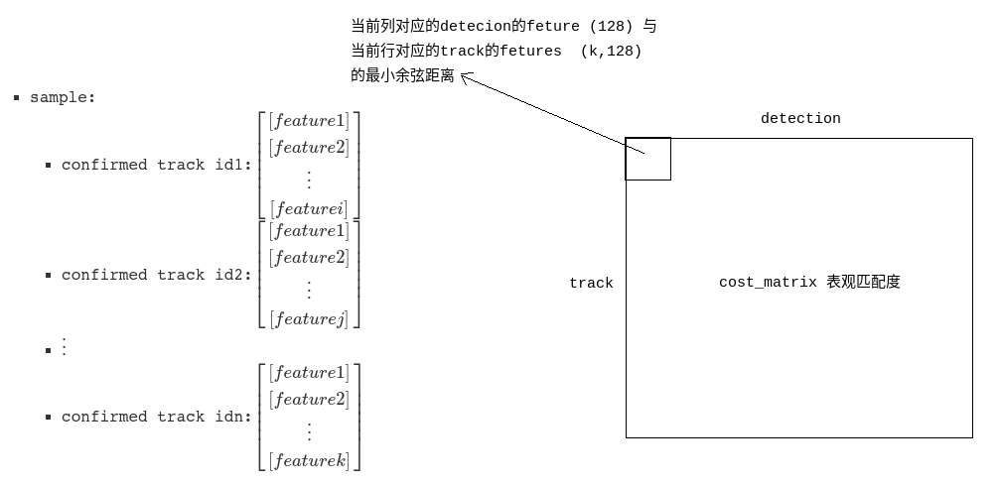
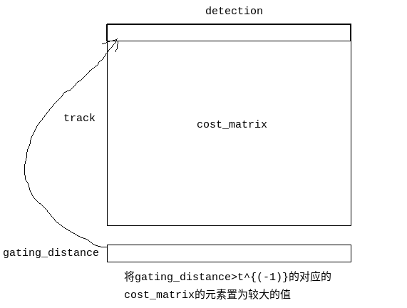
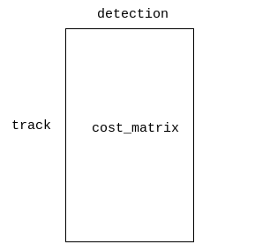
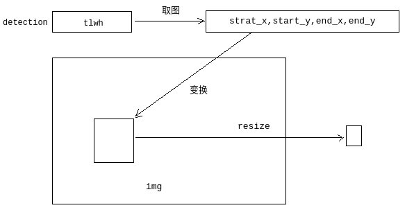
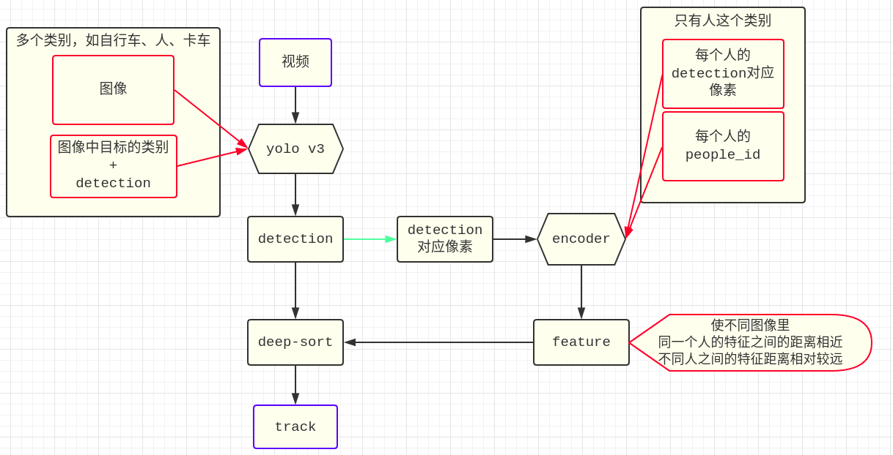

# deep-sort代码笔记
## Running the tracker
- [deep_sort_app](../deep_sort_app.py)
- 预先给定的detection格式
  - 集合:内容
  - \[0]:frame_idx
  - \[1]:??都是-1
  - \[2,5]:bbox
    - \[2]:top
    - \[3]:left
    - \[4]:w
    - \[5]:h
  - \[6]:confidence
  - \[10,138]:feature  128维的单位向量
- [deep_sort_app](../deep_sort_app.py).frame_callback()
  - 加载图像，加载detections
  - nms:保留在box之间IOU<阈值的最大置信度的box
  - 预测
  - 更新
  - 显示
  - 保存:保存confirmed状态且当前帧匹配上的track
- 状态空间方程
  - $\begin{cases}
    X_{k}&=AX_{k-1}+\epsilon_k \\
    Z_k&=HX_{k}+\delta_k
  \end{cases}$
  - $\begin{aligned}
    A&=\begin{bmatrix}
            1&0&0&0&1&0&0&0\\
            0&1&0&0&0&1&0&0\\
            0&0&1&0&0&0&1&0\\
            0&0&0&1&0&0&0&1\\
            0&0&0&0&1&0&0&0\\
            0&0&0&0&0&1&0&0\\
            0&0&0&0&0&0&1&0\\
            0&0&0&0&1&0&0&1
          \end{bmatrix} \\
    H&=\begin{bmatrix}
            1&0&0&0&0&0&0&0\\
            0&1&0&0&0&0&0&0\\
            0&0&1&0&0&0&0&0\\
            0&0&0&1&0&0&0&0
          \end{bmatrix} \\
    \epsilon_k&\sim N(0,\Sigma_{pre})\\
    \delta_k&\sim N(0,\Sigma_{innovation})
  \end{aligned}$
  - $X$:八维状态空间$(u,v,\gamma,h,\dot{x},\dot{y},\dot{\gamma},\dot{h})$
    - $(u,v)$:边界框的中心位置
    - $\gamma$:长宽比
    - $h$:高度
    - $(u,v,\gamma,h)$:观测值
    - $(\dot{x},\dot{y},\dot{\gamma},\dot{h})$:图像坐标中对应的速度信息
  - $Z$:四维空间$(u,v,\gamma,h)$

- 预测:[kalman_filter](../deep_sort/kalman_filter.py).predict()
  - predict($\mu,\Sigma$):对tracks里的每个track进行一次
    - $\mu=A\mu$
    - $\Sigma=A\Sigma A^T+\Sigma_{pre}$
      - $\Sigma_{pre}=\begin{bmatrix}
              \gamma_1^2&0&0&0&0&0&0&0\\
              0&\gamma_1^2&0&0&0&0&0&0\\
              0&0&10^{-4}&0&0&0&0&0\\
              0&0&0&\gamma_1^2&0&0&0&0\\
              0&0&0&0&\gamma_2^2&0&0&0\\
              0&0&0&0&0&\gamma_2^2&0&0\\
              0&0&0&0&0&0&10^{-10}&0\\
              0&0&0&0&1&0&0&\gamma_2^2
            \end{bmatrix}$
      - $\gamma_1=W_{position} * h$
      - $\gamma_2=W_{velocity} * h$
- 更新:[tracker](../deep_sort/tracker.py).update()
  - 第一帧
    - 匹配
      - confirmed_tracks=[]
      - unconfirmed_tracks=[]
      - 级联匹配
        - 所有detection分到unmatched_detection
        - min_cost_matching无操作
      - IOU分配
        - min_cost_matching无操作
    - 更新track集合
      - update无操作
      - mark_miss无操作
      - 将unmatched_detection里的每个detection[初始化成track](#unmatch_to_track),状态为Tentative，添加到tracks列表
    - 更新distance metric 无操作
  - 第二帧
    - 匹配
      - confirmed_tracks=[]
      - unconfirmed_tracks=[0,1,2,3,4,5,6,7,8] #tracks列表里状态不是confirmed的track
      - 级联匹配
        - 所有detection分到unmatched_detection
        - min_cost_matching无操作(第一帧的$a_i$=0)
      - IOU分配
        - track_indices=[0,1,2,3,4,5,6,7,8]
        - detection_indices=[0,1,2,3,4,5,6,7] #第二帧的detection
        - [min_cost_matching](#min_cost_matching)
        - matches_b=[(0, 0), (1, 1), (2, 2), (3, 5), (4, 3), (5, 6), (6, 4), (7, 7)]
        - unmatched_tracks_b=[8]
        - unmatched_detections=[]
      - 合并级联匹配和IOU分配
        - matches=[(0, 0), (1, 1), (2, 2), (3, 5), (4, 3), (5, 6), (6, 4), (7, 7)]#两者相加
        - unmatched_tracks:[8]#unmatched_tracks_a中$a_k$>1的track与unmatched_tracks_b并集
      - 返回matches, unmatched_tracks, unmatched_detections
    - 更新
      - 匹配成功的matches中每对进行一次更新
        - [kf](../deep_sort/kalman_filter.py).[update](#kalman_update)($\mu,\Sigma,z_k$)
        - 将当前detection的feature添加到track.feature
        - track的hit+=1,hit初始值为1
        - 将hit>=3且状态为Tentative的track变为Confirmed,现在没有符合的
      - 未匹配成功的unmatched_tracks中每个track进行一次mark_missed()
        - 如果track状态为暂定或者$a_k>A_{max}$，则将其置为Delete.
        - [8]为Delete
        - 此时,track_idx=[0,1,2,3,4,5,6,7]
      - 将unmatched_detection里的每个detection初始化成[track](#unmatch_to_track),状态为Tentative，添加到tracks列表
        - unmatched_detection为[]
      - 从tracks中删除状态为Delete的track
        - [8]被删除
    - 更新distance metric
      - 无操作
  - 第三帧
    - 匹配
      - confirmed_tracks=[]
      - unconfirmed_tracks=[0,1,2,3,4,5,6,7]
      - 级联匹配
        - 所有detection分到unmatched_detection=[0,1,2,3,4,5,6,7,8,9,10]
        - min_cost_matching无操作
      - IOU分配
        - track_indices=[0,1,2,3,4,5,6,7]
        - detection_indices=[0,1,2,3,4,5,6,7,8,9,10] #第二帧的detection
        - [min_cost_matching](#min_cost_matching)
        - matches_b=[(0, 0), (1, 1), (2, 5), (3, 6), (4, 4), (5, 2), (6, 3), (7, 7)]
        - unmatched_tracks_b=[]
        - unmatched_detections=[8,9,10]
      - 合并级联匹配和IOU分配
        - matches=[(0, 0), (1, 1), (2, 5), (3, 6), (4, 4), (5, 2), (6, 3), (7, 7)]#两者相加
        - unmatched_tracks:[]#unmatched_tracks_a中$a_k$>1的track与unmatched_tracks_b并集
      - 返回matches, unmatched_tracks, unmatched_detections
    - 更新
      - 匹配成功的matches中每对进行一次更新
        - [kf](../deep_sort/kalman_filter.py).[update](#kalman_update)($\mu,\Sigma,z_k$)
        - 将当前detection的feature添加到track.feature
        - track的hit+=1,hit初始值为1
        - 将hit>=3且状态为Tentative的track变为Confirmed
          - Confirmed_idx:[0,1,2,3,4,5,6,7]
      - 未匹配成功的unmatched_tracks中每个track进行一次mark_missed()
        - 无操作
      - 将unmatched_detection[索引为8,9,10的detection]里的每个detection初始化成[track](#unmatch_to_track)，并添加到tracks中
        - tacks_idx=[0,1,2,3,4,5,6,7,8,9,10]
          - 注意这里的8,9,10和unmatched_detection的当前帧detection的索引8,9,10并不相同,这里只是巧合
          - 当前帧索引为8,9,10的detection初始化为track，添加到tracks尾部
      - 从tracks中删除状态为Delete的track
    - 更新distance metric
      - 将Confirmed状态的track.features添加到features,并且Confirmed状态的track.features=[]
      - [samples](../deep_sort/nn_matching.py)保存Confirmed状态的track 最新的100个特征，[表观匹配度](deep-sort.md)**最新Lk=100之内**
        - {track id:特征}
        - 是track id不是track idx
  - **第四帧**
    - 匹配
      - confirmed_tracks=[0,1,2,3,4,5,6,7]
      - unconfirmed_tracks=[8,9,10]
      - 级联匹配
        - track_indices=[0,1,2,3,4,5,6,7]
        - detection_indices=[0,1,2,3,4,5,6,7,8,9,10]
        - 所有detection分到unmatched_detection,unmatched_detection=[0,1,2,3,4,5,6,7,8,9,10]
        - [min_cost_matching](#min_cost_matching_jilian)
        - matches_a=[(0, 0), (1, 1), (2, 3), (3, 4), (4, 2), (5, 6), (6, 5), (7, 7)]
        - unmatched_tracks_a=[]
        - unmatched_detections=[8,9,10]
      - IOU匹配
        - track_indices=[8,9,10]
        - detection_indices=[8,9,10] #级联匹配未成功的detection
        - [min_cost_matching](#min_cost_matching)
        - matches_b=[(8, 10), (9, 8), (10, 9)]
        - unmatched_tracks_b=[]
        - unmatched_detections=[]
      - 合并级联匹配和IOU分配
        - matches=[(0, 0), (1, 1), (2, 3), (3, 4), (4, 2), (5, 6), (6, 5), (7, 7), (8, 10), (9, 8), (10, 9)]
        - unmatched_tracks=[]#unmatched_tracks_a中$a_k$>1的track与unmatched_tracks_b并集
        - unmatched_detections=[]#级联匹配和IOU匹配都不成功的detection
    - 更新
      - 匹配成功的matches中每对进行一次更新
        - [kf](../deep_sort/kalman_filter.py).[update](#kalman_update)($\mu,\Sigma,z_k$)
        - 将当前detection的feature添加到track.feature
        - track的hit+=1,hit初始值为1
        - 将hit>=3且状态为Tentative的track变为Confirmed
          - Confirmed_idx还是之前的:[0,1,2,3,4,5,6,7]
          - Tentative_idx上一帧初始化的[8,9,10]
      - 未匹配成功的unmatched_tracks中每个track进行一次mark_missed()
        - 无操作
      - 将unmatched_detection里的每个detection初始化成[track](#unmatch_to_track)，并添加到tracks中
        - unmatched_detection=[],无操作
      - 从tracks中删除状态为Delete的track,无操作
    - 更新distance metric
      - 将Confirmed状态的track.features添加到features,并且Confirmed状态的track.features=[]
      - [samples](../deep_sort/nn_matching.py)保存Confirmed状态的track 最新的100个特征，[表观匹配度](deep-sort.md).partial_fit()**最新Lk=100之内**，代码中是nn_budget
        - {track id:特征}
        - 是track id不是track idx
  - 第五帧之后，和第四帧类似

- [track](../deep_sort/tracker.py)._initate_track()
  - mean=[mean_pos,mean_vel]
    - mean_pos为观测值detection的(x,y,a,h)，对应着[观测值](#observation)
      - x,y:中心点坐标
      - a:detection的w/h
      - h:detection的h
    - 速度信息(0,0,0,0)
  - covariance对角线为$std^2$,其他元素为0.
    - $\mathbb{covariance}=\Sigma_{init}=\begin{bmatrix}
        \gamma_1^2&0&0&0&0&0&0&0\\
        0&\gamma_1^2&0&0&0&0&0&0\\
        0&0&10^{-4}&0&0&0&0&0\\
        0&0&0&\gamma_1^2&0&0&0&0\\
        0&0&0&0&\gamma_2^2&0&0&0\\
        0&0&0&0&0&\gamma_2^2&0&0\\
        0&0&0&0&0&0&10^{-10}&0\\
        0&0&0&0&1&0&0&\gamma_2^2
      \end{bmatrix}$
    - $\gamma_1=2 * W_{position} * h$
    - $\gamma_2=10* W_{velocity} * h$
    - 取值原因不明
  - 新建的状态为Tentative的track，并添加到tracks列表

- 级联匹配
  - 算法逻辑见[deep-sort.md](deep-sort.md)
  - [linear_assignment](../deep_sort/linear_assignment.py).matching_cascade
    - ...
    - for $n \in\left\{1, \ldots, A_{\max }\right\}$ do
      - ...
      - min_cost_matching(track,detections)
        - 传入的track:状态为confirmed并且$a_k=n$的track
        - 传入的detection:unmatched_detection
        - 表观匹配度的[cost matrix](../deep_sort/nn_matching.py).distance()
          - 
          - $t^{(2)}$从级联匹配中传入，用的是定值，并不是论文中描述的从训练得到值
            - 这里传进来的max_distance为self.metric.matching_threshold
              - [nn_matching](../deep_sort/nn_matching.py).NearestNeighborDistanceMetric里有matching_threshold
              - [deep_sort_app]().run()
                - max_cosine_distance
                - **从arg中给的**
        - 运动匹配度的[距离](../deep_sort/linear_assignment.py).gate_cost_matrix(表观匹配度的cost_matrix)
          - 计算gating_distance
            - kalman.[project](#project)($\mu,\Sigma$)得到$\mu_{projec},\Sigma_{project}$
            - 对$\Sigma_{project}$进行[Cholesky分解](https://blog.csdn.net/acdreamers/article/details/44656847)得到$\Sigma_{project}=AA^T$中的A
            - 求$AX=Z_t-\mu_{project}$中的X
            - squared_maha = np.sum(X * X, axis=0) 
              - [ ] 这是啥???这个得到的是马氏距离??? 保留个数=unmatched_detection个数的距离
          - 
          - $t^{(1)}$:gating_threshold,在kalman_filter.py中定义为chi2inv95
        - 将cost_matrix中元素值>max_distance的值赋值为max_distance+1e-5
        - 线性分配:[匈牙利算法解决指派问题](https://www.cnblogs.com/chenyg32/p/3293247.html)
          - 选取矩阵就是m*n矩阵中，选取min(m,n)个元素，元素之间的行、列索引不能冲突，使得和最小
        - 线性分配得到元素的cost < max_distance(0.9),则被视为匹配成功;其余的都是未匹配成功

- IOU分配(sort论文的思想)
  - Associate remaining tracks together with unconfirmed tracks using IOU
  - [min_cost_matching](../deep_sort/linear_assignment.py).min_cost_matching(track,detections)
    - 传入的track:unconfirmed_tracks+级联匹配失败且只有1帧未匹配上的track
    - 传入的detection:级联匹配失败的detection
    - cost_matrix
      - 
      - $a_k>1$的track都是max_distance+1e-5
      - 其余为1-iou
    - 线性分配:[匈牙利算法解决指派问题](https://www.cnblogs.com/chenyg32/p/3293247.html)
      - 选取矩阵就是m*n矩阵中，选取min(m,n)个元素，元素之间的行、列索引不能冲突，使得和最小
    - 线性分配得到元素的cost < max_distance(0.7),即$a_k\leq1$的track,则被视为匹配成功;其余的都是未匹配成功
- [kf](../deep_sort/kalman_filter.py).update($\mu,\Sigma,z_k$)
  - project($\mu,\Sigma$)
    - $\mu_{project}=H\mu$
    - $\Sigma_{project}=H\Sigma H^T+\Sigma_{innovation}$
      - $\Sigma_{innovation}=\begin{bmatrix}
          \gamma^2&0&0&0\\
          0&\gamma^2&0&0\\
          0&0&10^{-2}&0\\
          0&0&0&\gamma^2
        \end{bmatrix}$
      - $\gamma=W_{postion}*h$
  - 求Kalman增益$K$
    - 对$\Sigma_{project}$进行[Cholesky分解](https://blog.csdn.net/acdreamers/article/details/44656847)
    - 求解$\Sigma_{project}X=(\Sigma H^T)^T$
    - $\begin{aligned}
      K=X^T&=\left[\Sigma_{project}^{-1}(\Sigma H^T)^T\right]^T \\
      &=\Sigma H^T (\Sigma_{project}^{-1})^T\\
      &=\Sigma H^T (\Sigma_{project}^{T})^{-1}\\
      &=\Sigma H^T \Sigma_{project}^{-1}\\
      &=\Sigma H^T (H\Sigma H^T+\Sigma_{innovation})^{-1}
    \end{aligned}$
  - [ ] $\begin{aligned}
    \mu&=\mu+(z_k -\mu_{project})K^T\\
    &=\mu+(z_k -H\mu)K^T
  \end{aligned}$
  - [ ] $\begin{aligned}
    \Sigma&=\Sigma-K\Sigma_{project}K^T\\
    &=\Sigma-K(H\Sigma H^T+\Sigma_{innovation})K^T
  \end{aligned}$

- 显示功能
  - ESC:退出
  - 空格:暂停
  - s:step

## Generating detections
- extract_image_patch
  - 
  - image_patches:当前帧的所有detection转化的patch
  - image_encoder(patch,batch_size)
    - 若patch足够多，分批次向encoder输入当前批次的patch，得到encoder输出
    - patch个数 < batch_size，输入patch，得到encoder输出
  - 返回encoder输出
- 输出 每帧的detection原始信息与encoder提取的特征 结合的结果
- 即预先给定的detection信息

## 逻辑
[流程图](https://www.processon.com/view/link/5e687d1fe4b0f2f3bd178ff6)
## 应用
- 原始yolo+原始deep_sort,存在问题
  - 

## code tips
- 回调函数使用
  - [deep_sort_app](../deep_sort_app.py).run里的visualizer.run(frame_callback)
    - 实际在[image_viewer](../application_util/image_viewer.py).run里面调用。调用是采用"函数名()"形式，"函数名"只是指针
- 求解矩阵方程Ax=b,先进行[矩阵分解](#Cholesky)再求解速度快